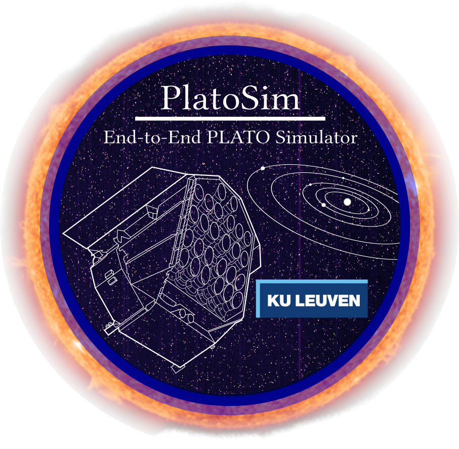

<!--  -->

<!--  -->
<!--  -->
<!--  -->
<!--  -->
<!--  -->

# Motivation

To accommodate PLATO's need of versatile simulations prior to mission launch -- that at the same time describe accurately the innovative but complex multi-telescope design -- we here present Platosim, the end-to-end PLATO camera simulator specifically developed for purpose. PlatoSim allows the user to simulate photometric time series of CCD images and light curves in accordance to the expected observations of PLATO. In the context of the PLATO payload, PlatoSim uses a general formalism of modelling the stellar field and sky background, the short and long-term barycentric pixel displacement of the stellar sources, the cameras and their optics, the CCDs and their electronics, and all main random and systematic noise sources. With its strong predictive powers and diverse applicability, PlatoSim is key simulator for PLATO Mission Consortium.

# Access and contribution

We welcome new users and encourage contributions. Simply contact one of the PlatoSim developers from KU Leuven and we will make sure to give you access. Note that in agreement with the regulations of the PLATO mission, you need a signed *Non Disclosure Agreement* (NDA) before we can give you access to PlatoSim.

# Installation

PlatoSim has the following installation procedures:

* [conda installation procedure](https://ivs-kuleuven.github.io/PlatoSim3/user-install.html) (recommended!)
* [straight from GitHub](https://ivs-kuleuven.github.io/PlatoSim3/dev-fork-clone.html)

# Getting Started

In order to provide a smooth start of your PlatoSim journey, we suggest that you both consult our [PlatoSim3 Documentation Page](https://ivs-kuleuven.github.io/PlatoSim3/) and our [Python Turorials](https://github.com/IvS-KULeuven/PlatoSim3/tree/master/docs/tutorials).

# Reference

Please cite Jannsen et al. (in prep.) if use this code in your research. The ADS BibTex entry for this paper will soon be available.

<!-- The BibTeX entry for the paper is: -->

# Feedback and Issues

If you have any questions or trouble using PlatoSim, please open a [GitHub Issue](https://github.com/IvS-KULeuven/PlatoSim3/issues). In case of issues -- to help us help you -- we recommend to provide the following information:

* PlatoSim version (bash command: `platosim --version`)
* Appropiate issue *label* (see right-hand menu)
* Concise explanation of the problem
* What were tried to investigate the problem?
* Please provide the `inputfile.yaml` and `log.txt` files (in debug mode: `--verbosity 3`)

---

Copyright 2023 - KU Leuven & The PlatoSim team
