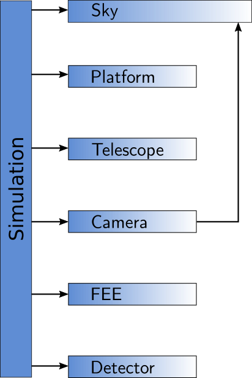
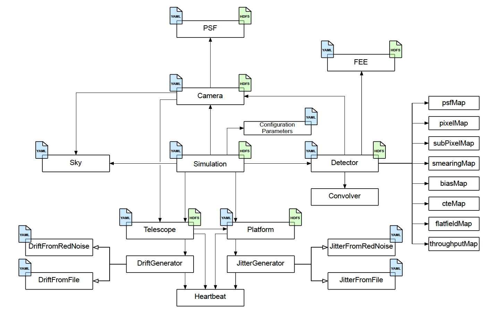
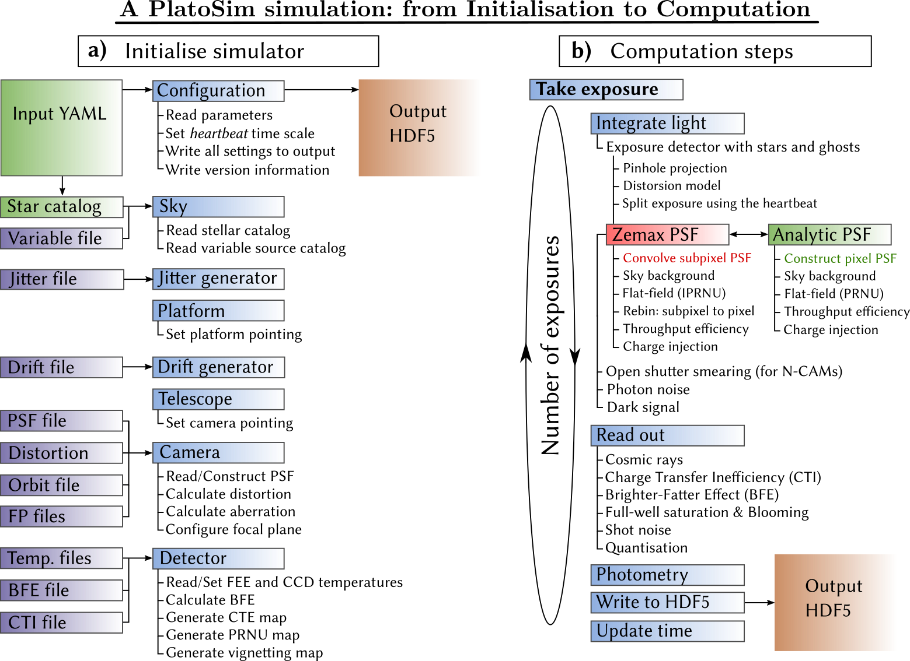

Architecture
============

The goal of PlatoSim's C++ code is to model a part of one CCD of a single telescope on the platform. We refer to this as the ``subfield``. On this page we describe the steps that are executed within a simulation in more detail.

PlatoSim has been rewritten from scratch in order to get rid of historical baggage and inefficient code constructions that had been built up for years. The PlatoSim v2 became impossible to maintain and it was very hard to add new features with confidence.

We therefore started from scratch with an object-oriented design and proper testing. We minimised the dependencies to external libraries and replaced inactive libraries with code that is still actively maintained.

.. raw:: html

   

General overview
----------------

The design of the PlatoSim started from the concept displayed in Fig. 1. The main hardware components that make up the PLATO spacecraft are the platform, (telescope), camera, and detectors, all of which are represented by a separate class in PlatoSim. Since we are simulating noise features on an image taken from the sky, we added the Sky class to the concept. All these components are controlled by a Simulation object.

   **Fig. 1**: Simulation object controlling classes. 

   
.. raw:: html

   

Conceptual design
-----------------
   
The more detailed design of PlatoSim is depicted in Fig. 2. The ``Simulation`` class in the center controls the process and knows about all the main components in the system.

   **Fig. 2**: Detailed conceptual design. 

Each of these main components has its own set of responsibilities:

    * ``Platform`` provides information about the pointing and the jitter,
    * ``Telescope`` controls the thermo-elastic drift of the cameras,
    * ``Camera`` provides information about the Point Spread Function (see ``PSF`` subclass),
    * ``Detector`` controls all the different (sub)pixel maps.
    * ``FEE`` controls the readout procedure and parameters for the electronics,
      
The blue file icons attached to several boxes indicate that information about its responsibility is provided in the YAML configuration file, while the green file icons indicate that the component is writing information into the HDF5 output file.

.. raw:: html

   

.. _basic_architecture_control:
   
Control flow
------------

Each PlatoSim simulation can be divided into two parts that happens sequential in time as shown in Fig. 3. Upon execution, PlatoSim first (a) read the configuration YAML file and initialises the Simulation object with these parameters. It further setup the random red noise generators, if requested by the user. Next (b) the actual computation of the pixel images begins. This happens in a loop over the number of exposures that is requested in the YAML configuration file. The two main steps in the simulation process are the integration of the light on the detector and the readout process.   

	   
   **Fig. 3**: Initialisation and execution of PlatoSim.
      
The flux of each star in the subfield is added to the sub-pixel map with the time interval of the pointing jitter and the duration of the exposure time. The background flux is then added and the subpixel map and is convolved with a rebinned PSF. After applying the flatfield, the subpixel map is rebinned to a pixel map, and the (geometric) vignetting is applied.

During the readout process all the noise features are applied on the pixel map. Many of the features can be switched **on** or **off** in the YAML configuration file, some features need to get a value of ``yes`` (``True``) or ``no`` (``False``) in order to be included or ignored, respectively. After processing each exposure, the pixel map is written to the output HDF5 file and the option to write also the subpixel maps can be enabled in the YAML configuration file. Details about detected stars, their positions, and the pointing information is finally written to the output HDF5 file.
