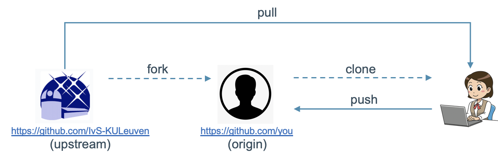

# Update Procedure {#dev-pull}

In the course of the development process, the code in the `upstream` repository will be updated.  The `develop` branch will always contain the latest version of the code, whereas the `master` branch is (supposed to be) stable and well-tested.

To get the latest version on your local machine, execute the following command:

    $ git pull upstream/develop

for the `develop` branch or

    $ git pull upstream/master

for the `master` branch.

To incorporate these changes in the `origin` repository, execute the following command:

    $ git push origin develop

for the `develop` branch

and

    $ git push master

for the `master` branch.

This is shown schematically in the figure below.

However, this will only work smoothly if you did not change any of the PlatoSim3 files or added files to the PlatoSim3 folders. The only exceptions are the <code>/inputfiles</code> and the <code>/build</code> folder, where you can add files.  Please, do not modify the original files in the <code>/inputfiles</code> folder, as this might cause problems when updating the software.  We recommend that you copy the <code>inputfile.yaml</code> file and modify the copy rather than the original file.

Please note that you have to re-build the code each time you fetch software changes. How to do this is explained @ref dev-building "here".
