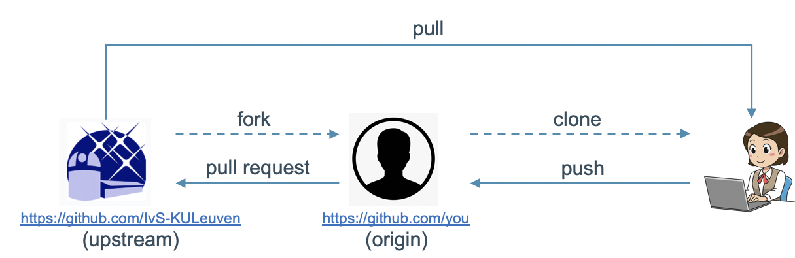
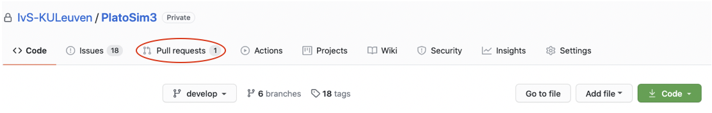
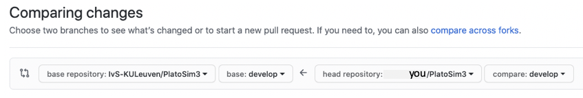

# Contributing to the Code {#dev-push}

This section contains all information that is needed to be able to contribute to PlatoSim3. If something is missing from these guides, or you have a different system / installation, let us know with all the details so we can enhance these guides. We assume you already went through the procedure to use the code.

Do not forget to bring you local repository in line with the upstream, as explained here. The full cycle is depicted below.

---

## Pushing your Changes

If you have made local changes to some files that are already under version control or you have added new files, and you want to transfer these changes to the `origin` repository, you must first "stage" these files and then "commit" them.

Staging a file can be done with the command

    $ git add <relative path to the file>

To inspect the status of the files in your local repository, execute the following command:

    $ git status

To "commit" all staged files, execute the following command:

    $ git commit -m "<commit message>"

We advise you not to squeeze to much into one commit and to write clear commit messages.

You can now transfer the committed changes to the `origin` repository with the command

    $ git push origin develop

To further transfer these changes to the `upstream` repository, you must open a pull request (see below).

### Graphical Git Clients

Alternatively, you can use a graphic git client to perform the steps described above.  An overview of the possibilities can be found [here](https://git-scm.com/downloads/guis).

---

## Pull Requests

Now that you have "pushed" your changes to the `origin` repository, you want your changes to be incorporated into the `upstream` repository, so other people can benefit from your efforts.

To do this, go to the [upstream GitHub page](https://github.com/IvS-KULeuven/PlatoSim3).

Just select the `"Pull requests"` tab at the top (encircled in red in the screenshot above).  From there you can open a new pull request by pressing the green `"New pull request"` button.  Select `"compare across forks"`, and then you can compare the `upstream` repository (on the left-hand side in the screenshot below) and the `origin` repository (on the right-hand side in the screenshot below).  You will get an overview of the differences between the two.

To confirm you want to open a pull request, press the green `"Create pull request"` button and fill out the required information.  The development team will review the changes, and accept or reject the request.
