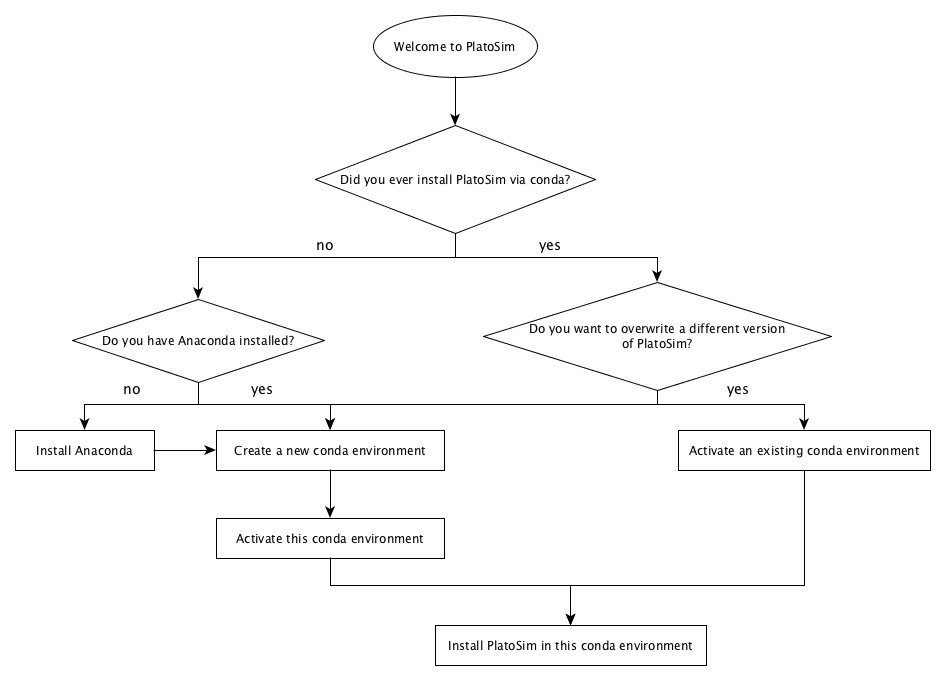
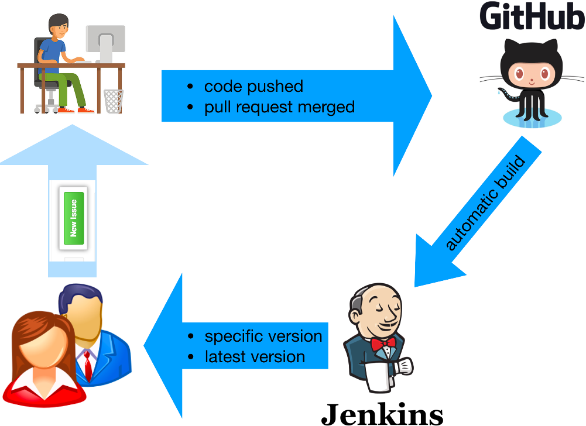

For Users (via Conda)
=====================

To make life easier on the people who want to use PlatoSim without ever wanting to touch the code, we have started using `Jenkins <https://www.jenkins.io/>`_ to automatically build PlatoSim, enabling you to download the latest successfully built version or the :ref:`master or develop branch <install_source_brancing>`, or any specific version(s) of these. The flowchart below summarises the steps you have to take.

.. admonItion:: Step-by-Step
   
   To be able to install PlatoSim3 via conda, have a look at the following steps:
	 
   * :ref:`Prerequisites <install_conda_prerequisites>`: needed to download and update PlatoSim.
   * :ref:`Installing (and Updating) <install_conda_installing>`: PlatoSim in a dedicated Conda environment.
   * :ref:`A Word about Jenkins <install_conda_jenkins>`: to monitor the status of the PlatoSim builds.

     
.. raw:: html

   

   
.. _install_conda_prerequisites:

Prerequisites
-------------

*Creating Conda Environments*
.............................

To be able to install PlatoSim via conda, you have to have the Python distribution `Anaconda <https://docs.continuum.io/anaconda/install/>`_ installed. You have to create an `Conda environments <https://conda.io/projects/conda/en/latest/user-guide/tasks/manage-environments.html>`_, here called platosim, as follows:

.. code-block:: shell
		
   conda create -n platosim python=<Python version>

but it is advisable to use multiple conda environments if you want to be able to switch between version and/or branches in a smooth way (e.g. ``platosimMaster`` and ``platosimDevel``). **Supported Python versions are 3.8 and 3.9**. Please note that when you switch to a different version of Python it is advised to create a new conda environment rather than trying to update your existing one. It will save you a lot of trouble if you do it like this.

To get an overview of all your conda environments, type:

.. code-block:: shell

   conda env list

The active environments will be marked with ``*``.

*Activating and De-activating Conda Environments*
.................................................

Each time you install a different version of PlatoSim or if you want to use a specific version of PlatoSim you have installed (via conda) on your system, you have to activate the appropriate conda environment, which is done as follows:

.. code-block:: shell

   conda activate <environment name>		

To de-activate the environment you are currently on, type 
   
.. code-block:: shell

   conda deactivate
		   
.. raw:: html

   

   
.. _install_conda_installing:

Installing (and Updating)
-------------------------

.. attension::

   Please, contact the developer team for the username and password.

Before you install another version of PlatoSim3, you must activate the desired conda environment. It is not necessary to create a new conda environment every time you install a different version of the software, unless you want to use multiple versions in parallel.

The installation procedure will automatically detect which operating system your are running and will install the appropriate packages for you.

Before you install PlatoSim via conda, for the first time in this environment, type: 

.. code-block:: shell
		
   conda config --add channels conda-forge
   
*Master Branch*
...............

To install the latest successfully built version of the ``master`` branch, type: 

.. code-block:: shell

   conda install -c https://jenkins.miricle.org/platosim/ platosim

To install a specific version (only for the master branch), just append ``<version>=`` to this command.

*Developer Branch*
..................

For the develop branch, these commands must be replaced by 

.. code-block:: shell

   conda install -c https://jenkins.miricle.org/platosim.devel/ platosim

and:

.. code-block:: shell

   conda update --force-reinstall -c  https://jenkins.miricle.org/platosim.devel/ platosim

respectively.

*Credential*
............

If no pop-up window, asking for the credentials, appears, adapt the conda install commands from above, by replacing ``https://jenkins`` with ``https://<username>:<password>@jenkins``. Please request the ``<username>`` and ``<password>`` from one of the PlatoSim developers.

.. raw:: html

   

   

   
.. _install_conda_jenkins:

A Word about Jenkins
--------------------

We have started using `Jenkins <https://www.jenkins.io/>`_ to automatically build PlatoSim and make pre-built software available for a myriad of operating systems. The figure below summarises how we want to use it.

Each time code is pushed to the repository (either to the ``master`` or the ``develop`` branch) or a pull request is merged in GitHub, Jenkins will start building the new code, resolves the dependencies for you, and makes it available via the conda installation command. In case the build was successful, users can install this build on their system.

To monitor the status of the PlatoSim builds, check `here <https://jenkins.miricle.org/view/Platosim/>`_.

